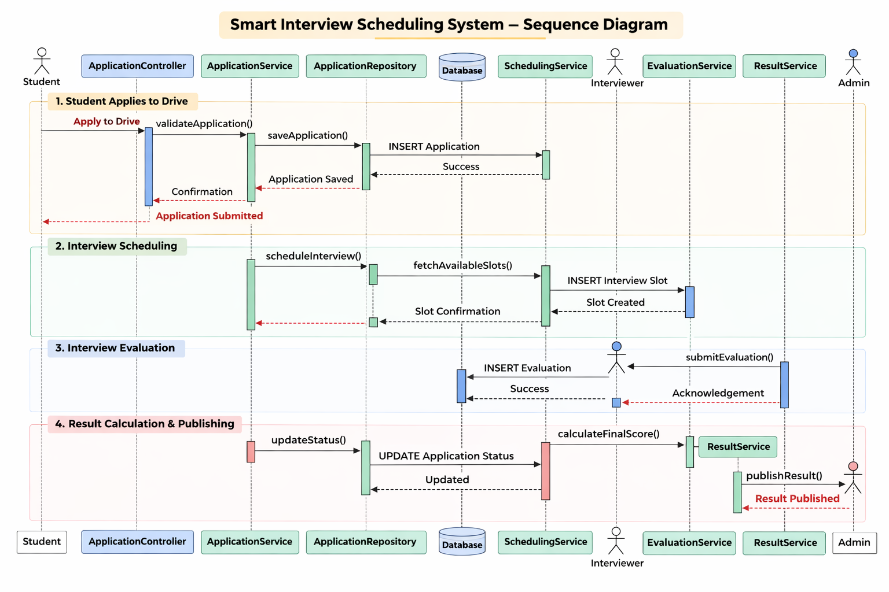

# Sequence Diagram  
Smart Interview Scheduling System  

## Main End-to-End Backend Flow  
(Student Application to Result Publication)

This sequence diagram represents the layered backend architecture 
showing controller, service, repository, and database interactions 
from student application to result publication.
